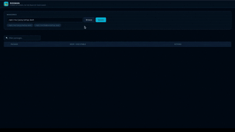

# ROS Manager (rosman)

I was working on a project on automated driving whose system was built on ROS2. Those who have worked with ROS2 know that in such complex system, there are many different nodes that need to be started at the same time, so that they exchange topics. Sure I could write a launch file a start all nodes from that single file. But I needed something more.


I wanted a browser-based UI for managing your ROS2 nodes - start, stop and stream logs without touching the terminal. And that led to me building `ROSMAN`.

ROSMAN (ROS2 Manager) is an interface that allows you to control your nodes via a UI that runs on your localhost. It uses FastAPI on the backend and a simple web frontend, with Python in the backend.



---

## How It Works

ROSMAN runs a local web server on your machine. You open it in your browser, you enter the absolute path of the setup file of the ROS2 workspace you are working in. That will give you a list of nodes in that workspace and lets you manage your nodes through the UI.

---

## Requirements

- ROS2 installed (any distro — Humble, Iron, Jazzy, etc.)
- Python 3.8+
- `zenity` (for the workspace file picker — usually pre-installed on Ubuntu with a desktop environment)

---

## Installation

```bash
git clone https://github.com/cmodi306/rosman_app.git
cd rosman_app
pip install -r requirements.txt
```

---

## Usage

1. Start the server:

   ```bash
   uvicorn main:app --port 8000
   ```

2. Open your browser and go to `http://localhost:8000`

3. Click **Browse** to select your ROS2 workspace setup file (e.g. `install/setup.bash`)

4. Pick a package and node, then hit **Start**. Logs will stream live in the UI.

5. Click **Stop** to kill a running node. All nodes are automatically stopped when the server shuts down.

---

## Future ToDOs

- [ ] Launch file support
- [ ] Parameter editing via UI

---

## Support

If rosman saves you some terminal headaches, consider showing some love:

- ☕ [Buy me a coffee](https://buymeacoffee.com/cmodi306)
- ✍️ [Follow me on Medium](https://medium.com/@cmodi306) for more content on tech
- [Substack](https://substack.com/@cmodi306)
- [Bluesky](https://bsky.app/profile/cmodi306.bsky.social)
- [Mastodon](https://mastodon.social/@cmodi3006)
